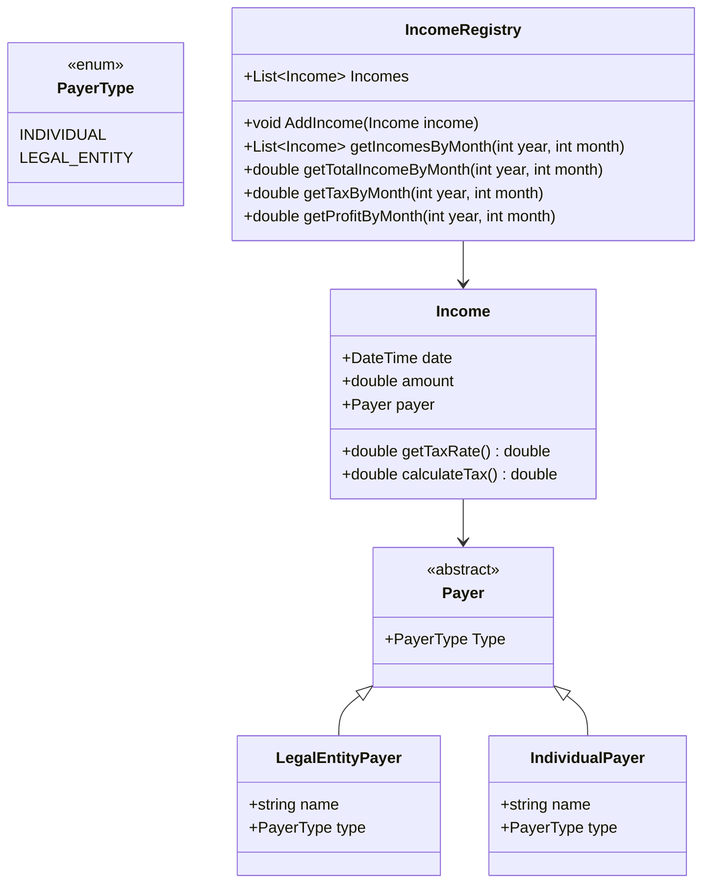

# Учёт доходов самозанятых

## ЗАДАНИЕ

Разработать объектно‑ориентированное решение для учёта доходов самозанятого с поддержкой аналитики.
Обязательно должны быть тесты и документация.
Необходимо фиксировать дату дохода, сумму дохода, от кого получено.
Аналитики: сколько всего было дохода в месяц, какой будет налог на доход от физических и юридических лиц и общая сумма налога, прибыль.

